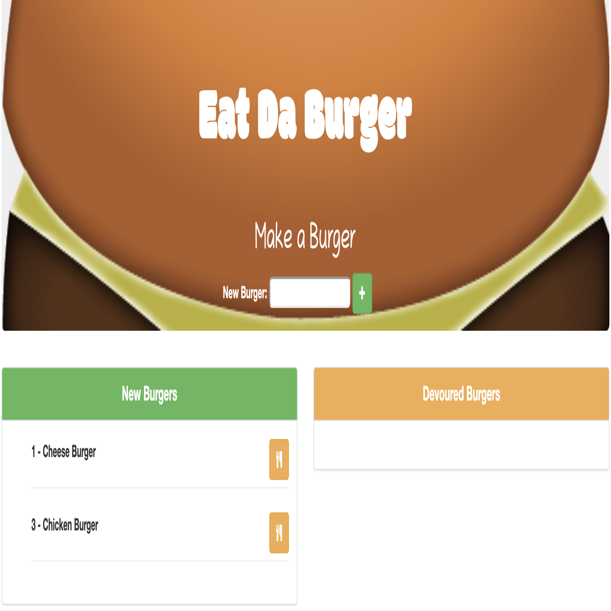

# Eat-Da-Burger

**Eat-Da-Burger** is a full stack burger logger with MySQL, Node, Express, Handlebars and a ORM that follows MVC design pattern. Node and MySQL is used to query and route data in the app, and Handlebars to generate your HTML.


## Getting Started

- Clone down repo.
- Node.js - Download the latest version of Node https://nodejs.org/en/
- Run command 'npm install' in Terminal or GitBash to install npm packages dependencies needed for this app.
- create .env file and store your MySQL password for the localhost as MYSQLPASS=yourpassword.
- Run the schemal.sql and seeds.sql in the MySQL workbench.

## Deployed Website
**Eat-Da-Burger** is deployed to Heroku. [Here](https://intense-spire-41805.herokuapp.com) is the link to the deployed site.

## How to Use
To use our web service, go to our [Website](https://intense-spire-41805.herokuapp.com). Write the name of the burger you wish to eat in the text form field and click on the plus button to add the burger to the "New Burgers" section. Click on the folk and knife button to eat the burger. The burgers you ate will be displayed on the "Devoured Burger" section. Click on the trash button to delete the burgers you wish to remove from the list.

### Homepage



## Directory Structure

```
.
├── config
│   ├── connection.js
│   └── orm.js
│ 
├── controllers
│   └── burgers_controller.js
│
├── db
│   ├── schema.sql
│   └── seeds.sql
│
├── models
│   └── burger.js
│ 
├── node_modules
│ 
├── package.json
│
├── public
│   └── assets
│       ├── css
│       │   └── burger_style.css
│       └── img
│       |   └── burger.png
|       |   └── eat_da_burger.png
|       └── js
│           └── app.js
│
├── server.js
│
└── views
|   ├── index.handlebars
|    └── layouts
|        └── main.handlebars
├── keys.js
```

## Tech used
- Bootstrap
- Handlebars
- JavaScript
- JQuery
- Node.js
- ORM
- MySQL
- Express - https://expressjs.com/
- Express NPM Package- https://www.npmjs.com/package/express
- Heroku - https://www.heroku.com
- .gitignore - to tell git not to track files such as node_modules and thus they won't be committed to Github.

## Authors

* **Youngwoo Cho** - *Node JS / Express / MySQL / Handlebars / ORM* - [Youngwoo Cho](https://github.com/catnap89)